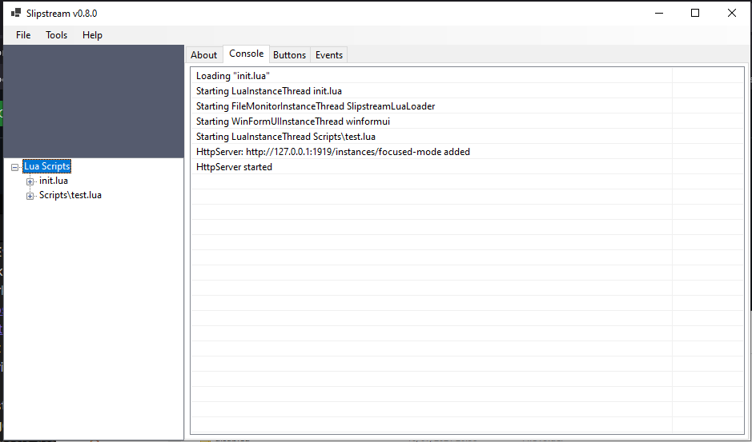

# Slipstream

**⚠ This project is under early and experimental development and should be considered alpha
software ⚠**

## What is Slipstream?

Slipstream is an application with an event-based architecture that allows 
users to programatically handle events using Lua scripts. The primary
objective for the application is to provide a dynamic and flexible solution
to act on [iRacing](http://www.iracing.com) telemetry events.

The extensibility of the core application can easily accomodate other types
of plugins to create a comprehensive solution for iRacers and streamers. 



Other plugin examples are: 
- Twitch chat
- User interaction (button click)
- File monitor
- Lua scripts

## How it works

Events raised by the plugins are sent to Lua scripts where the events can be translated
to real world actions like:
- Interacting with IoT devices
- Playing audio samples
- Text to speech

Example script
```Lua
local whitelist = {}

whitelist["sassy_mcsassypants"] = true
whitelist["larryrabbets"] = true

say_name = {}
say_name["sassy_mcsassypants"] = "Sassy"
say_name["larryrabbets"] = "Larry"

function string.starts(String,Start)
   return string.sub(String,1,string.len(Start))==Start
end

function handle(event)
    print(event_to_json(event))
    if(event.EventType == "TwitchReceivedMessage") then
        if string.starts(event.Message, "!say ") then
            if whitelist[string.lower(event.From)] then
                local text = string.lower(string.sub(event.Message, 6))
                audio:say(say_name[event.From:lower()] .. " said ... " .. text, 1)
            else
                twitch:send_channel_message(event.From .. ": You are not whitelisted to use !say")
            end
        end
    end
end
```

## Installation

Download the latest version of
[Slipstream](https://github.com/dennis/slipstream/releases/download/v0.3.0/slipstream-v0.3.0.msi)
and run the installer.

## Usage

 - Upon launch, go to menu: Help -> Open Scripts Directory
 - Download and save [LuaScripts/debug.lua](LuaScripts/debug.lua) into this
   directory. This will output the received events as JSON

## Contributing

We welcome feature requests, bug reports and contributions for code and
documentation.

If you like to contribute to Slipstream, please read our [Code of
Conduct](CODE_OF_CONDUCT.md) first.

### Reporting Issues

Reporting bugs can be done in the GitHub [issue
tracker](https://github.com/dennis/slipstream/issues). Please search for
existing issues first to help prevent duplicates.

### Pull Requests

Patches are welcome, but if you do a significant change, please talk with use
before doing so. You are welcome to open an issue descriping your idea.

## License

Slipstream is released under the [ISC License](LICENSE)
